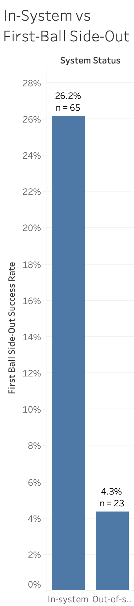
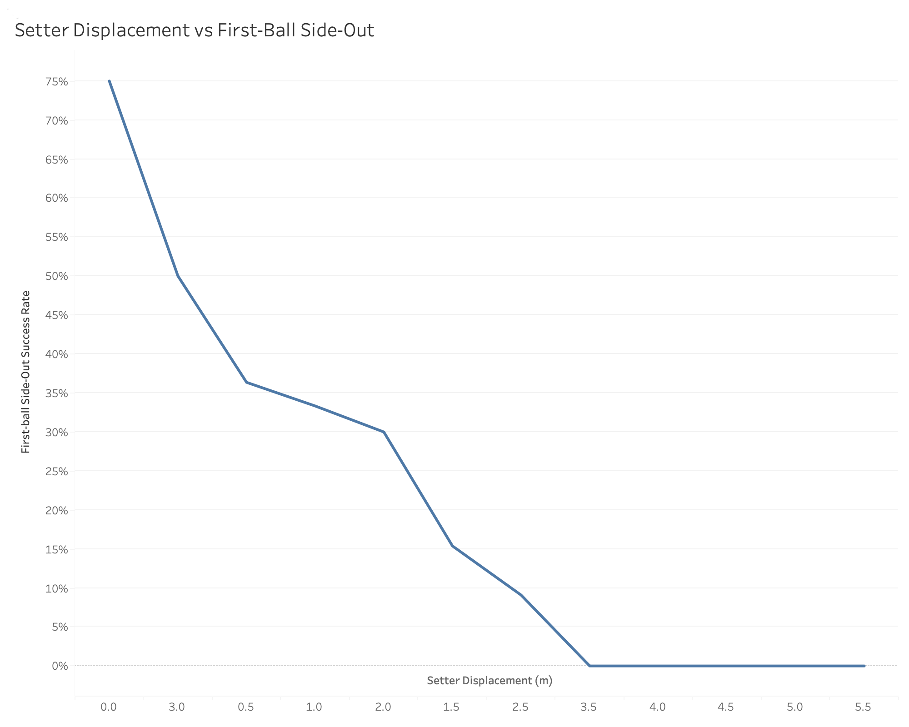
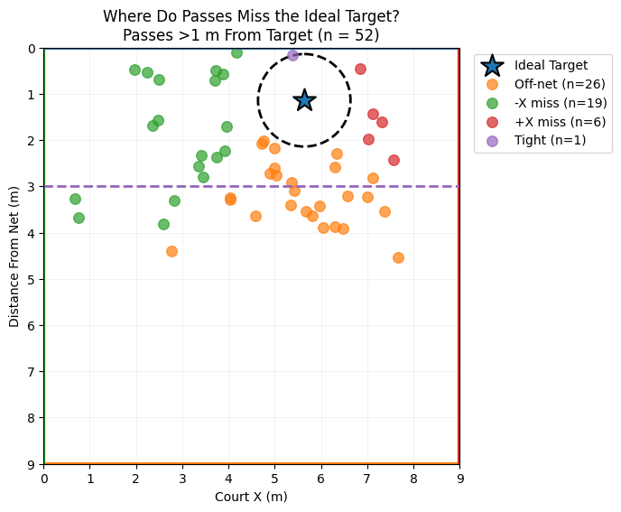

# RallyFlow 🏐

### Looking beyond the 0–3 pass rating to understand what actually creates a successful first-ball side-out

I started RallyFlow because, as a volleyball player, I kept wondering how much a traditional 0–3 pass rating actually tells us. Two passes can get the same rating but put the setter in completely different positions, change which hitters are available, and lead to very different attacks.

That made me curious about what we might be missing when we reduce an entire serve-receive play to one number. I built RallyFlow to track what happens throughout the play—from where the pass goes and how far the setter moves to where the attack lands—and then analyze how those factors relate to first-ball side-out success.

## Research Question

**What factors are associated with successful first-ball side-outs in volleyball?**

## How RallyFlow Works

I use RallyFlow while watching match film to record what happens from the serve through the first attack. Instead of only recording the outcome of the play, I wanted to capture what actually happened on the court leading up to it.

  

*RallyFlow's annotation interface combines video review with interactive court coordinates and rally-level data collection.*

For each rally, I can record:

**Serve Receive**
- Pass rating (0–3)
- Pass contact and destination coordinates
- Reception technique

**Setter Movement**
- Setter starting position
- Ideal passing target
- Setter contact position
- Displacement from the ideal target
- Total setter travel

**Offensive Context**
- In-system vs. out-of-system
- Set location
- Rotation
- Number of blockers faced

**Attack**
- Attack type
- Attack contact and destination coordinates
- Attack outcome
- First-ball side-out success

Putting all of this together creates a rally-level dataset where I can look at not only whether a team sided out, but also what happened throughout the play that may have contributed to that result.

## Pilot Study

I recently finished collecting my first **121 rallies**. Since this is still a pretty small dataset, I am treating this as a pilot study rather than trying to make broad conclusions about volleyball from it.

My main goal with this first analysis was actually to test RallyFlow itself: **Am I collecting data that can reveal useful patterns?**

I also wanted to figure out which questions seem worth investigating further and where my data-collection process could improve before I build a much larger dataset.

Because some measurements do not apply to every rally or were missing in the original data, the sample size is different for each analysis.

### What I Wanted to Investigate

1. Does pass quality relate to first-ball side-out success?
2. What happens to first-ball side-out success as the setter moves farther from the ideal passing target?
3. How much does being in-system vs. out-of-system matter?
4. Does set location relate to first-ball side-out success?
5. Where are attacks landing, and does attack destination relate to effectiveness?
6. How does the number of blockers faced relate to first-ball side-out success?
7. Does first-ball side-out success differ by rotation?
8. When passes miss the ideal target, where are they actually going?
9. How much does the setter have to travel in each rotation?

## Methods

After collecting the rallies, I cleaned the dataset and analyzed it using **Python, Google Colab, and Tableau**.

I definitely did not use the exact same statistical test for every question. The variables were different, so I tried to choose a method that actually made sense for the relationship I was looking at.

- **Logistic regression** — to examine how numerical variables such as pass rating and setter displacement related to the probability of a successful first-ball side-out.
- **Fisher's exact test** — for categorical comparisons with small sample sizes, including in-system vs. out-of-system rallies.
- **Permutation testing** — when some groups had very few observations and I did not want to rely too heavily on assumptions that might not hold with the pilot dataset.
- **ANOVA** — to compare average setter travel across rotations.
- **Descriptive analysis** — for more exploratory questions where I compared percentages, averages, counts, and spatial patterns without trying to make a strong statistical conclusion.

I used **Tableau** for several comparison charts and **Python/Matplotlib** for the spatial court maps and more customized visualizations.

One thing I learned pretty quickly was that a graph can look dramatic even when there are barely any observations behind it 😭. Because of that, I started including sample sizes in my visualizations and tried to separate an interesting pattern from something the data could actually support.

## Key Findings

The pilot gave me a lot to explore, but these are the findings that stood out to me the most. I chose them because they either showed that RallyFlow was capturing patterns I would expect to see in volleyball or showed why collecting spatial data could be useful beyond traditional stats.

I analyzed nine questions in total, so these are just the highlights. The rest of the pilot analysis is included separately in this repository.

### 1. Better passes were connected to more first-ball side-outs

This was probably the most expected result, but I was honestly happy to see it because it showed that RallyFlow was picking up a relationship that makes sense in actual volleyball.

First-ball side-out success increased from **0% on 0-passes to 47.6% on 3-passes**. Logistic regression also found a statistically significant positive relationship between pass rating and first-ball side-out success (**β = 1.284, p = .014**).

  

The interesting part for me was how quickly the success rate changed as pass quality improved. I definitely want to see whether that pattern stays similar once the dataset becomes much larger.

### 2. Setter displacement gave me a more precise way to look at pass quality

This is where RallyFlow started getting more interesting to me.

Instead of only giving a pass a 0–3 rating, I could measure how far the setter actually ended up from the ideal passing target.

Successful first-ball side-outs had an average setter displacement of **1.52 m**, compared with **2.30 m** on unsuccessful attempts. As displacement increased, the predicted probability of a successful first-ball side-out decreased (**β = −0.683, p = .026, n = 67**).

  

There is one pretty important catch: pass rating and setter displacement were strongly related (**r = −0.793**), which makes sense. Better passes usually end up closer to the setter's target.

So the question I am more interested in now is whether displacement can eventually tell me something useful that the traditional pass rating does not.

### 3. Pass misses were definitely not going in random directions

This was probably one of my favorite things to visualize because a normal pass rating would never show it.

I mapped where the setter contacted each pass relative to the ideal target. Of the **52 passes that finished more than 1 m from the target, 50.0% (26/52) primarily missed off-net**. Only **1.9% (1/52)** primarily missed toward the net.

There was also a noticeable sideways imbalance: **36.5%** of misses were primarily in the −X direction compared with **11.5%** in the +X direction.

  

Instead of just saying that a pass was "off target," RallyFlow lets me see *how* it was off target. I think this could eventually be useful for identifying team-specific passing tendencies or even creating more actionable feedback for players.

I still need to be careful about interpreting the X-direction pattern until I fully standardize how court orientation is represented across matches.

### 4. Staying in-system made a pretty big difference

First-ball side-out success was **26.2% for in-system rallies (17/65)** compared with only **4.3% for out-of-system rallies (1/23)**.

Fisher's exact test found evidence of an association between system status and first-ball side-out success (**p = .0335**).

  

Again, the general direction is not exactly shocking—being in-system is supposed to be good 😭. What interests me more is eventually connecting this result back to the spatial measurements. For example: **How much setter displacement does it usually take before an offense actually becomes out-of-system?**

That is the kind of question I would like RallyFlow to answer with a larger dataset.

## Full Pilot Analysis

These four findings are only part of the first RallyFlow analysis.

I also investigated **set location, blockers faced, rotation, attack destination, and setter travel by rotation**.

Some produced interesting early patterns, while others mostly showed me that I need more data before I can say much—which is kind of the point of doing the pilot in the first place.

A few examples:

- **Set location:** Location 3 had the highest observed first-ball side-out rate at 38.5%, but several locations had very small sample sizes.
- **Blockers faced:** Among normal attacks, first-ball side-out success was 40% against one blocker and 24% against two blockers, but the difference was not statistically significant (**p = .324**).
- **Rotation:** R6 had the highest observed first-ball side-out rate at 50% (5/10), but the small sample made that result especially important to interpret cautiously.
- **Attack destination:** Hard-driven attack depth was not significantly associated with kill outcome in this pilot (**permutation p = .871**).
- **Setter travel:** Average setter travel differed across rotations (**ANOVA, F = 25.64, p < .001**), with R1 and R4 requiring the greatest average travel.

The full visualizations and statistical results are available in the analysis section of this repository.

## What I Learned From the Pilot

The biggest thing I learned from the first 121 rallies is that RallyFlow **can collect data detailed enough for patterns to show up**, but I also learned how easy it is to get excited about a pattern before checking how much data is actually behind it.

There are several limitations I want to address as the project grows:

- **Small sample size.** 121 rallies is nowhere near enough to treat these results as general volleyball conclusions.
- **Different sample sizes across analyses.** Not every measurement is available or applicable for every rally.
- **One dataset.** The current results may reflect the specific team, opponents, competition level, or matches included rather than volleyball more broadly.
- **Related variables.** Variables such as pass rating, setter displacement, and system status are connected to each other, which makes it harder to isolate what is actually driving an outcome.
- **Manual data collection.** I am currently annotating rallies from film myself, which takes a lot of time and also raises questions about measurement consistency.

Honestly, those limitations made the project more interesting to me instead of less. The pilot gave me a much clearer idea of what I need to improve next.

## Where I Want to Take RallyFlow Next

My next goal is to expand RallyFlow from a small pilot into a larger and more reliable volleyball dataset.

A few things I want to work on:

- **Collect substantially more rallies** across multiple matches and, eventually, different teams.
- **Test whether spatial variables add predictive information beyond traditional stats**, especially whether setter displacement tells us something beyond pass rating alone.
- **Improve the data-collection workflow** so rallies can be annotated faster and more consistently.
- **Explore multivariable models** that consider pass quality, setter displacement, system status, rotation, set location, and blocking context together instead of analyzing everything one variable at a time.
- **Investigate player- and rotation-specific patterns** once the dataset is large enough to support them.
- **Explore computer vision or machine-learning approaches** that could eventually automate parts of the annotation process.

The part I am most interested in right now is figuring out which measurements are actually worth collecting. RallyFlow currently records a lot of information, but more data is not automatically better data. As I continue the project, I want the tool to become more focused on the variables that actually help explain what happens during a rally.

## Why I'm Sharing This

RallyFlow is still very much a work in progress. I am sharing the project because I want to keep improving both the tool and the way I am approaching the analysis.

I am especially interested in feedback on the **research design, spatial measurements, statistical methods, and what questions would be most valuable to investigate with a larger dataset**.

If you work in sports analytics, statistics, data science, biomechanics, computer vision, or a related area and have thoughts on the project, I would genuinely love to hear them.
