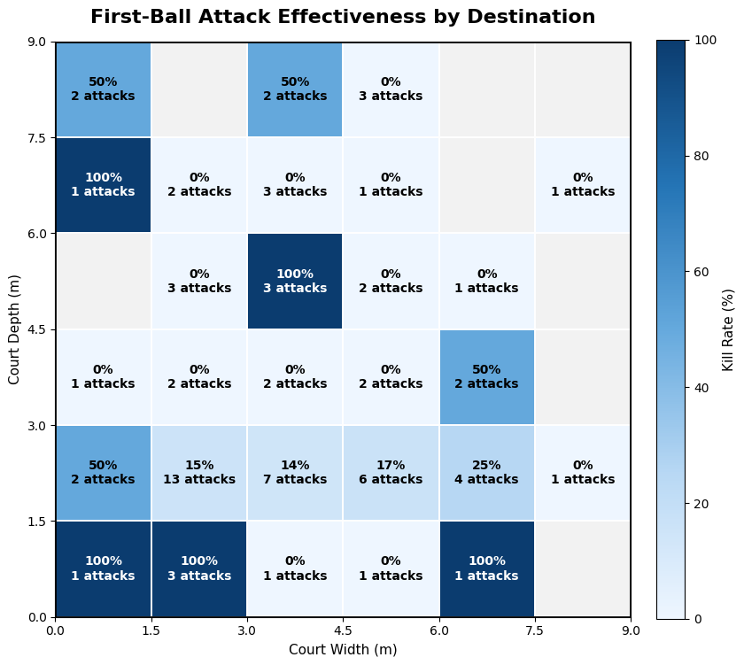
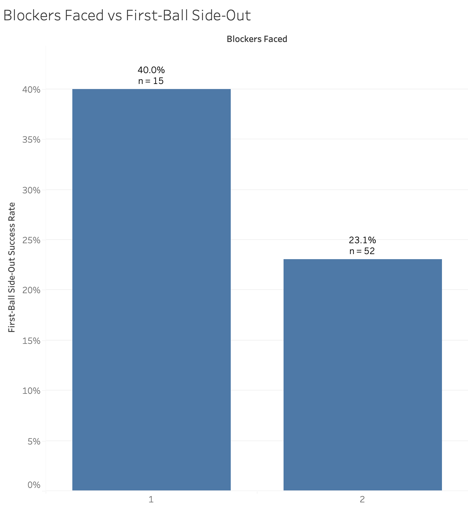
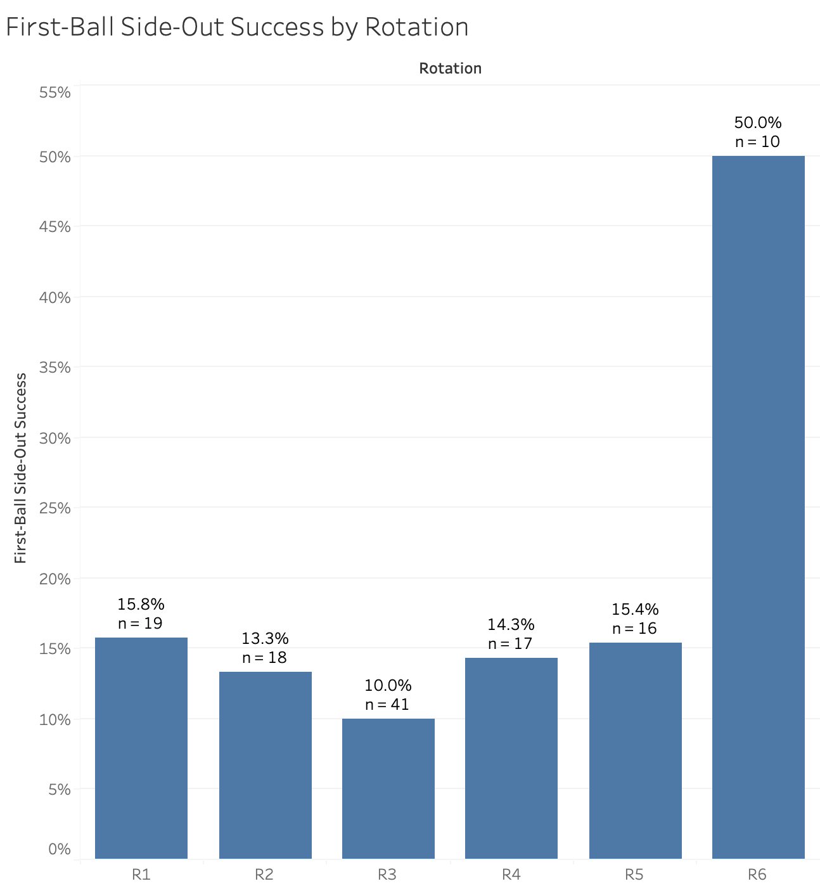
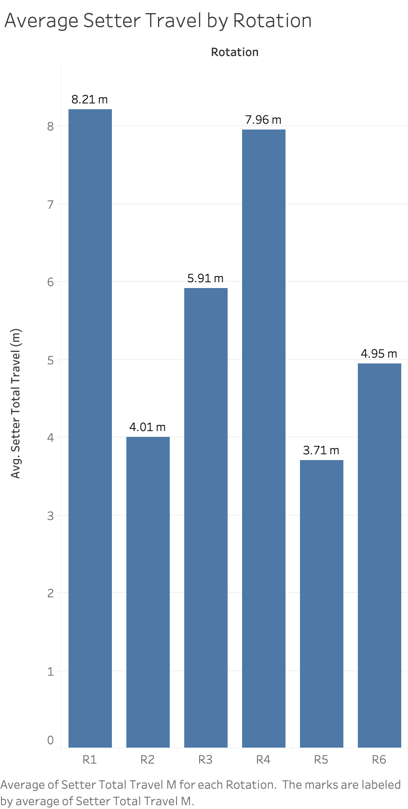

# RallyFlow Pilot Analysis

## Overview

This page contains the full analysis from my first **121 rallies collected with RallyFlow**.

The main purpose of this pilot was not to make broad conclusions about volleyball performance. I wanted to test whether the variables I chose to collect could actually reveal useful patterns, figure out which measurements seemed worth keeping, and identify questions I want to investigate with a much larger dataset.

Because not every variable was available or applicable for every rally, **sample sizes vary between analyses**.

## Analysis Questions

1. [Pass Rating and First-Ball Side-Out](#1-pass-rating-and-first-ball-side-out)
2. [Setter Displacement and First-Ball Side-Out](#2-setter-displacement-and-first-ball-side-out)
3. [In-System vs. Out-of-System](#3-in-system-vs-out-of-system)
4. [Set Location](#4-set-location)
5. [Attack Destination](#5-attack-destination)
6. [Blockers Faced](#6-blockers-faced)
7. [Rotation](#7-rotation)
8. [Pass Destination and Miss Direction](#8-pass-destination-and-miss-direction)
9. [Setter Travel by Rotation](#9-setter-travel-by-rotation)

---

## 1. Pass Rating and First-Ball Side-Out

### Question

**Does traditional pass rating (0–3) relate to first-ball side-out success?**

### Results

First-ball side-out success increased as pass rating improved:

| Pass Rating | Successful Side-Outs | Total | Success Rate |
|---|---:|---:|---:|
| 0 | 0 | 16 | 0.0% |
| 1 | 1 | 27 | 3.7% |
| 2 | 7 | 45 | 15.6% |
| 3 | 10 | 21 | 47.6% |

Logistic regression found a statistically significant positive relationship between pass rating and first-ball side-out success (**β = 1.284, p = .014**).

  

### What I Took From This

This was probably the least surprising result of the pilot—better passes leading to better offensive outcomes makes sense. But that was actually useful. One of my first questions was whether RallyFlow was collecting data that could reproduce relationships I would expect to see in actual volleyball.

The more interesting question for me became whether RallyFlow's spatial measurements could tell me anything **beyond** the traditional pass rating.

---
## 2. Setter Displacement and First-Ball Side-Out

### Question

**How does setter displacement from the ideal passing target relate to first-ball side-out success?**

### Results

For the 67 rallies with setter displacement data:

- **Successful first-ball side-outs:** 1.52 m average displacement
- **Unsuccessful first-ball side-outs:** 2.30 m average displacement

As setter displacement increased, the predicted probability of a successful first-ball side-out decreased.

Logistic regression found a statistically significant negative relationship between setter displacement and first-ball side-out success (**β = −0.683, p = .026, n = 67**).

  

### What I Took From This

This was one of the results I was most interested in because setter displacement gives me an actual spatial measurement instead of just a pass category.

There is an important catch, though. Pass rating and setter displacement were strongly negatively correlated (**r = −0.793**), so I cannot treat them as completely separate factors. With more data, I want to test whether setter displacement adds useful information beyond what the traditional pass rating already tells us.

---

## 3. In-System vs. Out-of-System

### Question

**Does being in-system relate to first-ball side-out success?**

### Results

First-ball side-out success was:

- **In-system:** 26.2% (17/65)
- **Out-of-system:** 4.3% (1/23)

Fisher's exact test found statistically significant evidence of an association between system status and first-ball side-out success (**p = .0335**).

  

### What I Took From This

The direction of this result was not exactly shocking 😭. Being in-system is supposed to give an offense more options.

What I think could become more interesting is connecting system status back to the spatial measurements RallyFlow collects. For example, I want to investigate how much setter displacement usually occurs before a rally gets classified as out-of-system and whether that boundary is actually consistent.

---

## 4. Set Location and First-Ball Side-Out

### Question

**How does set location relate to first-ball side-out success?**

### Results

Observed first-ball side-out rates were:

| Set Location | Successful | Total | Success Rate |
|---|---:|---:|---:|
| 1 | 0 | 2 | 0.0% |
| 2 | 6 | 26 | 23.1% |
| 3 | 5 | 13 | 38.5% |
| 4 | 7 | 33 | 21.2% |
| 5 | 0 | 3 | 0.0% |
| 6 | 0 | 12 | 0.0% |

Location 3 had the highest observed first-ball side-out rate at **38.5%**, followed by locations 2 and 4.

  

### What I Took From This

At first glance, location 3 looks really interesting. The problem is that the sample sizes are super uneven. Locations 1 and 5, for example, only had two and three observations.

Because of that, I do not think this pilot can tell me what the "best" set location actually is. This is one of those graphs that reminded me why I need to look at the numbers behind the bars before getting too excited about the bars themselves.

---

## 5. Attack Destination

### Question

**What spatial attack selection is associated with first-ball attack effectiveness?**

### Results

When I first looked at all attack destinations, short attacks seemed surprisingly effective. But the dataset included different attack types, including tips, rolls, tools, free balls, and other non-standard attacks.

To make the comparison more meaningful, I looked specifically at **hard-driven attacks**.

Among hard-driven attacks with usable destination-depth data:

| Depth | Attacks | Kills | Kill Rate |
|---|---:|---:|---:|
| Short (0–3 m) | 30 | 10 | 33.3% |
| Middle (3–6 m) | 7 | 3 | 42.9% |
| Deep (6–9 m) | 4 | 1 | 25.0% |

The observed kill rates differed, but the middle and deep groups were tiny. A permutation test found **no statistically significant association between attack depth and kill outcome (p = .871)**.

  

### What I Took From This

This analysis was actually a good example of the pilot changing how I thought about my own data.

Originally, I saw a lot of successful attacks landing short and wondered whether short shots were somehow more effective. Then I realized attack type was mixed into that pattern. A ball tooling the block, a tip, and a hard-driven swing can all end up in similar parts of the court for completely different reasons.

Once I separated hard-driven attacks, the evidence for an attack-depth pattern basically disappeared. I definitely need a lot more attacks before trying to identify an "optimal" destination.

---

## 6. Blockers Faced

### Question

**How does the number of blockers faced relate to first-ball side-out success?**

### Results

I excluded rallies with zero blockers from this comparison because many of those plays represented situations that were not comparable to a normal first-ball attack.

Among normal attacks:

- **1 blocker:** 40% first-ball side-out success (6/15)
- **2 blockers:** 24% first-ball side-out success (12/50)

The observed success rate was higher against one blocker, but the difference was **not statistically significant (p = .324)**.

  

### What I Took From This

The direction makes volleyball sense: attacking against one blocker should generally give the hitter more options than attacking against a formed double block.

But this is another result where the pilot is not large enough for me to say much more than that. I want to keep collecting blockers faced because I think it could become especially interesting when combined with set location, system status, and pass quality.

---

## 7. Rotation and First-Ball Side-Out

### Question

**Does first-ball side-out success differ by rotation?**

### Results

Observed first-ball side-out rates were:

| Rotation | Successful | Total | Success Rate |
|---|---:|---:|---:|
| R1 | 3 | 19 | 15.8% |
| R2 | 2 | 15 | 13.3% |
| R3 | 4 | 40 | 10.0% |
| R4 | 2 | 14 | 14.3% |
| R5 | 2 | 13 | 15.4% |
| R6 | 5 | 10 | 50.0% |

R6 had the highest observed first-ball side-out rate at **50% (5/10)**, while R1–R5 ranged from about 10–16%.

  

### What I Took From This

Okay, R6 definitely jumps off the graph 😭. But it only contains 10 rallies, so I do not want to treat 50% as a stable estimate yet.

This is exactly the kind of pattern I want to keep watching as the dataset grows. If R6 continues to perform differently after hundreds more rallies, then I can start digging into *why*—whether it is setter positioning, personnel, passing, available attackers, or something else.

---

## 8. Pass Destination and Miss Direction

### Question

**When passes miss the ideal target, where are they actually going?**

### Results

For the 67 rallies with usable setter-contact coordinates, average displacement from the ideal passing target decreased as pass rating improved:

- **1-pass:** 3.93 m
- **2-pass:** 2.38 m
- **3-pass:** 0.90 m

Only **15 of 67 passes** finished within 1 m of the ideal target, and all 15 were rated as 3-passes.

I then looked specifically at the **52 passes more than 1 m from the ideal target**.

Their primary miss directions were:

- **Off-net (+Y):** 50.0% (26/52)
- **−X:** 36.5% (19/52)
- **+X:** 11.5% (6/52)
- **Toward the net (−Y):** 1.9% (1/52)

  

### What I Took From This

This might be my favorite spatial result from the pilot.

The passes were not just missing the target by some random amount. The misses were heavily concentrated in particular directions, especially **away from the net**.

A traditional pass rating tells me that a pass was imperfect. The spatial data can tell me *how* it was imperfect.

I still need to standardize court orientation carefully before making too much of the sideways X-direction pattern, especially if I eventually combine data across teams or matches.

---

## 9. Setter Travel by Rotation

### Question

**How much does the setter have to travel in each rotation?**

### Results

Average setter travel differed significantly across rotations (**ANOVA, F = 25.64, p < .001**).

The largest average travel distances were:

- **R1:** 8.21 m
- **R4:** 7.96 m

The smallest was:

- **R5:** 3.71 m

  

### What I Took From This

This result made me realize that setter movement is not only determined by pass quality. The setter's starting position changes by rotation, so some rotations naturally require much more movement before the setter even gets to the target area.

That matters for how I interpret setter travel. A setter moving 8 m does not automatically mean the pass was terrible—they may have started much farther away.

It also gave me another question I want to explore later: whether the **extra movement caused by the pass itself**, rather than total setter travel, is more useful for predicting offensive success.

---

# Overall Takeaway

The biggest thing I got from this pilot was not one magic volleyball finding.

It was evidence that RallyFlow is collecting enough detail to let me ask questions that would be difficult to answer from a normal stat sheet alone.

Some results were statistically significant. Some showed interesting patterns but were way too small to trust yet. And some basically told me, "yeah...you need more data" 😭.

Honestly, that was useful too.

The next step is to collect a much larger dataset and start looking at these variables together instead of one at a time. I am especially interested in whether spatial measurements such as **setter displacement and pass direction add useful information beyond traditional pass rating**, and how those relationships change across rotations and offensive situations.
